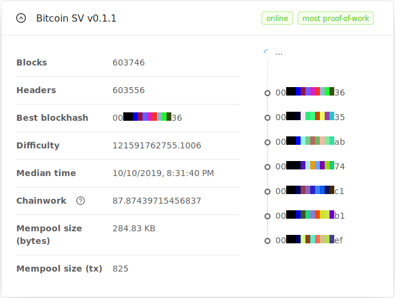

# Bitcoin Node Monitor

> Bitcoin node information GUI

[](https://www.npmjs.com/package/bitcoin-node-monitor)



## NPM
```
 $ npm install -g bitcoin-node-monitor
 $ bitcoin-node-monitor
```
### Configuration

Default config file is `~/.config/bitcoin-node-monitor/config.js`

## Docker
```
docker run -p 4343:4343 -v /absolute/path/to/config.js:/app/config.js ledgit/bitcoin-node-monitor
```

## NPM Package
```
npm install bitcoin-node-monitor
```
```javascript
const bnm = require('bitcoin-node-monitor');
const config = require('./YOUR-CONFIG-FILE');
bnm(config);
```

## From source

1. Clone this repo
2. `npm install`
3. `npm run <dev|prod>`
